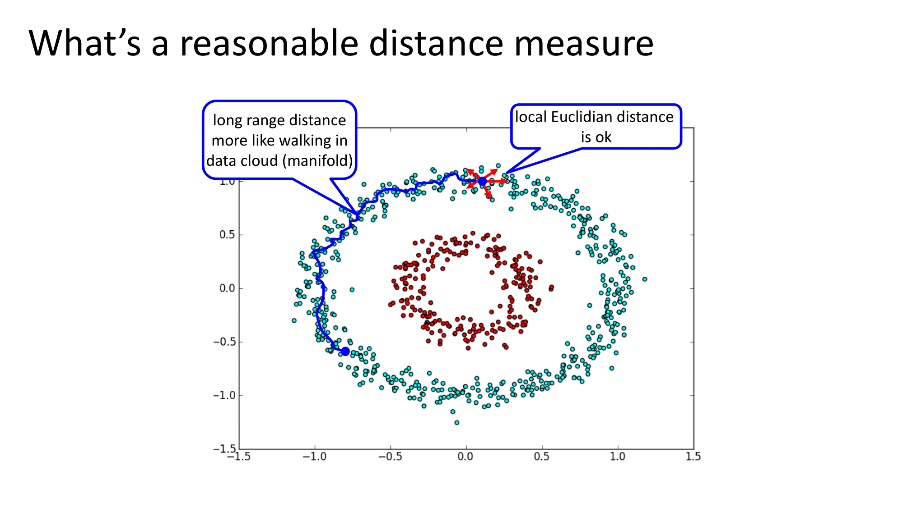
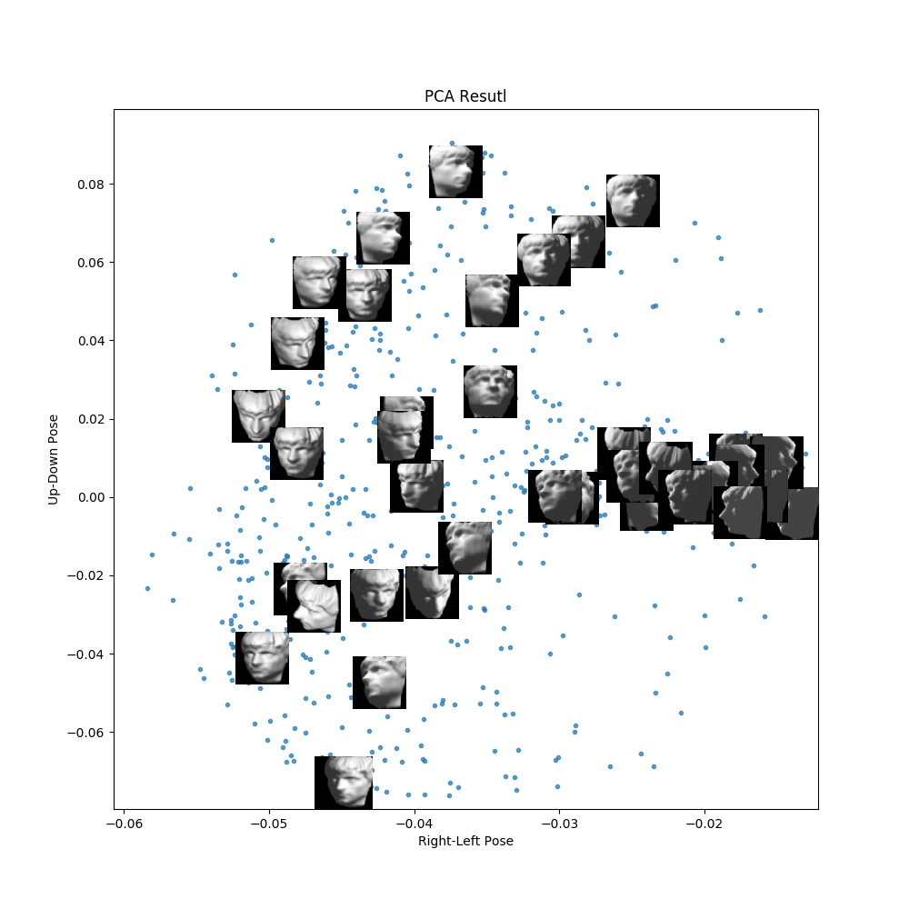
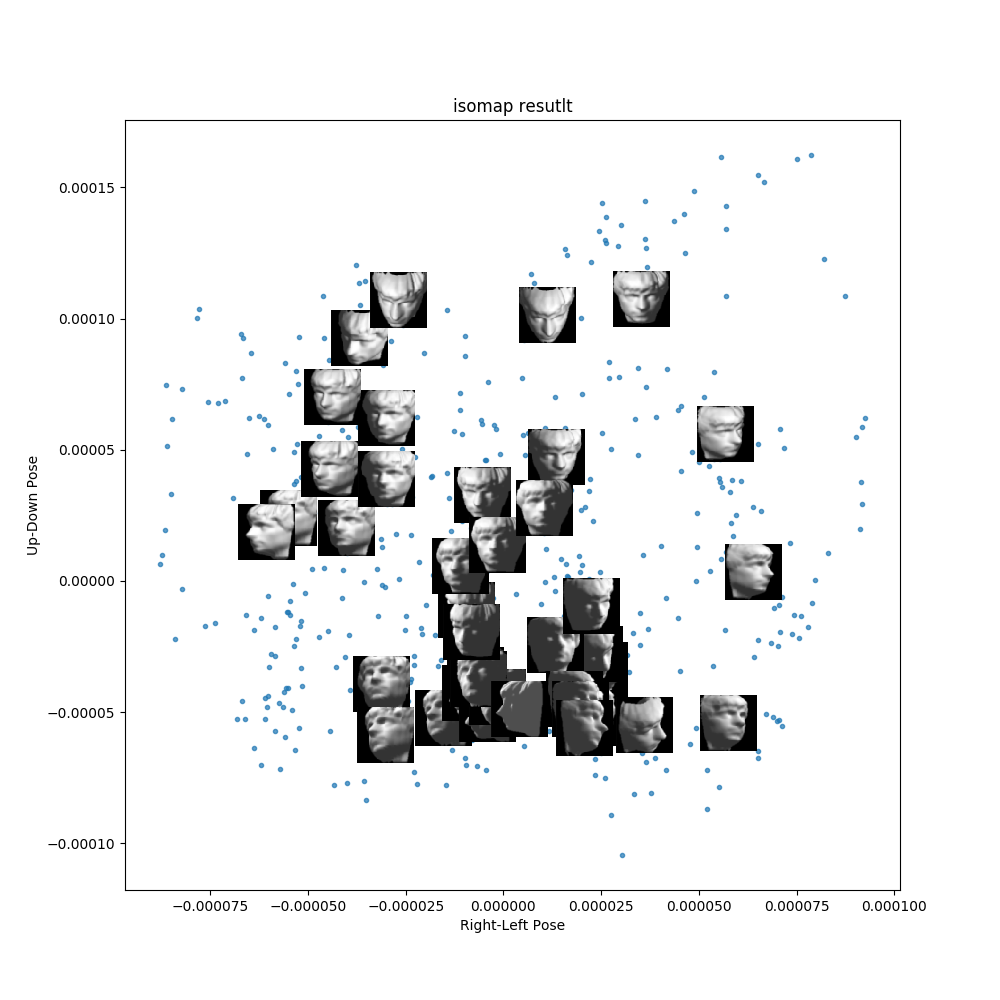

@title[INTRODUCTION]
@snap[midpoint h1-orange]
# ISOMAP
Non-Linear Model Reduction 
@snapend

@snap[south-east span-20] 
@size[0.75em](Luke Wileczek) 
@snapend  

---

@snap[h3-orange]
### TL;DR
@snapend
ISOMAP is a non-linear model reduction method to reduce the size and complexity
of a dataset, projecting it onto a new plane. This method is useful for datasets
with non-linear structure, where
[PCA](https://en.wikipedia.org/wiki/Principal_component_analysis) and [MDS](https://en.wikipedia.org/wiki/Multidimensional_scaling) will not be appropriate. 

---

@title[Basic Questions]
@snap[north h3-orange]
###  Questions
@snapend  

@snap[west span-90 text-07]
  - *What is this method?* 
  - *What does it do? When should I use it?* 
  - *What are the alternatives and how does this one compare?* 
  - *What are it’s failure modes (when not to use) and how to you diagnose them?*
  - *How do I call this (is there are module/package? git repo? other?)*
@snapend

Note:

Questions:
  - *What is this method?* ISOMAP, a Non-Linear Dimension Reduction method  
  - *What does it do? When should I use it?* This projects the dataset into a reduce
plane that shrinks the dimension while keeping _most_ of the information from
the data.  It essentially transforms the space in which the data is
represented. This can be used to shrink the size of a non-linear
high-dimensional dataset like images, or as a pre-processing step for
clustering.   
  - *What are the alternatives and how does this one compare?* Alternatives are PCA,
and MDS for linear data and t-SNE for non-linear.  There are actually many
Manifold learning methods which can be seen [here](https://en.wikipedia.org/wiki/Nonlinear_dimensionality_reduction) and newly published in
2018, [UMAP](https://arxiv.org/pdf/1802.03426v2.pdf)   
  - *What are it’s failure modes (when not to use) and how to you diagnose them?*
ISOMAP is dependent on thresholding or
[KNN](https://en.wikipedia.org/wiki/K-nearest_neighbors_algorithm) in it's first
step to create an adjacency matrix, which can be sensitive to noisy or sparse
data.  In addition, it can become computationally expensive.   
  - *How do I call this (is there are module/package? git repo? other?)*
Implementations of ISOMAP can found in most programming languages, but to start
exploring I suggest [Sci-Kit
Learn](https://scikit-learn.org/stable/modules/manifold.html) for Python.


+++
@snap[h3-orange]
### What is this method?
@snapend
ISOMAP, a Non-Linear Dimension Reduction method  

+++
@snap[h3-orange]  
### What does it do? When should I use it?  
@snapend    

This projects the dataset into a reduce
plane that shrinks the dimension while keeping _most_ of the information from
the data.  It essentially transforms the space in which the data is
represented. This can be used to shrink the size of a non-linear
high-dimensional dataset like images, or as a pre-processing step for
clustering.   

+++
@snap[h3-orange]
### What are the alternatives and how does this one compare?
@snapend


@snap[south-east span-40] @size[0.75em](From SciKit-Learn Manifold Learning) @snapend

+++
Alternatives are PCA,
and MDS for linear data and t-SNE for non-linear.  There are actually many
Manifold learning methods which can be seen [here](https://en.wikipedia.org/wiki/Nonlinear_dimensionality_reduction) and newly published in
2018, [UMAP](https://arxiv.org/pdf/1802.03426v2.pdf)   

+++
@snap[h3-orange]
### What are it’s failure modes & how to you diagnose them?
@snapend

ISOMAP is dependent on thresholding or
[KNN](https://en.wikipedia.org/wiki/K-nearest_neighbors_algorithm) in it's first
step to create an adjacency matrix, which can be sensitive to noisy or sparse
data.  In addition, it can become computationally expensive.   

+++
@snap[h3-orange]
### How Do I Call This Method?  
@snapend

Implementations of ISOMAP can found in most programming languages, but to start
exploring I suggest [Sci-Kit Learn](https://scikit-learn.org/stable/modules/manifold.html) for Python.

---
@title[dimension-reduction]
@snap[north-east span-60 h3-orange h4-orange]  
#### Dimension Reduction  
@snapend

@snap[west span-40 text-07]
Dimension reduction is used in when we have very high-dimensional data, which is
to say many columns or features. This appears often in image processing and 
biometric processing. In many cases, we want to reduce the complexity, size of
the data, or improve interpretation. We can use dimension reduction methods to
achieve this using methods like PCA for linear data and ISOMAP for non-linear
data.
@snapend

@snap[east span-50]

@snapend

@snap[south-east span-20] @size[0.75em]([Image Source](https://bigsnarf.wordpress.com/category/thoughts/page/4/)) @snapend

+++
@snap[north h3-orange]  
### When To Use
@snapend  

@snap[west text-07]
  - Under-determined system, more features than samples (Regularization)
  - Data is too large for system, cannot afford more compute
  - Reduce size of data to decrease time to solve, time sensative
  - Removal of multi-collinearity 
  - Can lead to improved model accuracy for regression and classification
    [Rico-Sulayes, Antonio (2017)](https://www.researchgate.net/publication/322835219_Reducing_Vector_Space_Dimensionality_in_Automatic_Classification_for_Authorship_Attribution)
  - Visualize the relationship between the data points when reduced to 2D or 3D
@snapend

Note:

TL;DR:
  - Feature Selection
  - Feature Projection
  - Size Reduction
  - Visual Charting in 2 or 3 dimensions 

---
@snap[h3-orange]
### Algorithm
@snapend

There are three steps to the ISOMAP algorithm.

---
@title[step-1]
@snap[h3-orange h3-orange h4-orange]
### Step 1 Adjacency & Distance Matrices
@snapend

  

Image from Georgia Tech ISyE 6740, Professor Xie
+++

Since our data has a non-linear form we will view our data as a network.  This
will allow us to have some flexibility around the shape of our data and connect
data that is "close".  There are two ways to create your edges between your
nodes 

+++
The first way to create edges is to use
[KNN](https://en.wikipedia.org/wiki/K-nearest_neighbors_algorithm) and connect
each node to the closest `K` neighbors.  Note that we do not need to use
Euclidean distance but can and should try many different distances to see which
has the best results for your particular dataset.  Often in high dimensions,
Euclidean distance breaks down and we must start searching elsewhere. 
See links at the bottom for information on different distance metrics.

+++
Alternatively, you can use threshold to decide your edges. If two points are
within your distance threshold, then they are connected, otherwise the distance
between the two nodes is set to infinity. You can tune your threshold so that
each node has some minimum number of connections, which is what we'll use in our
example.

+++
Once you have your adjacency matrix, we'll create our distance matrix which has
the shortest path between each point and every other point.  This matrix will be
symmetric since we are not creating a directed graph.  This is the main
difference between ISOMAP and a linear approach.  We'll allow the path to travel
through the shape of the data showing the points are related even though they
might not actually be "close" regarding your distance metric. 

+++ 

For example, if our adjacency matrix is

```
[[0   0.2 INF],
 [0.2 0   0.7]
 [INF 0.7   0]]
```

Then our distance matrix `D` would be 

```
[[0   0.2 0.9],
 [0.2 0   0.7]
 [0.9 0.7   0]]
```
Because 1 can reach 3 through 2

---
@title[step-2]
@snap[h3-orange]
### Step 2 Centering Matrix
@snapend  

Now we'll create the centering matrix that will be use to modify the distance
matrix `D` we just created. 


Now, we'll use this centering matrix on our distance matrix `D` to create our
kernel matrix, `K`


---
@title[step-3-eigendecomposition]
@snap[north h3-orange h4-orange]  
### Step 3 Eigenvalues & Eigenvectors  
@snapend  

@snap[west text-07]
Finally, we take an eigenvalue decomposition of the kernel matrix `K`. The
largest N (in our case 2) eigenvalues and their corresponding eigenvectors
are the projections of our original data into the new plane.
Since eigenvectors are all linearly independent thus, we will avoid collision.
@snapend

---
@title[the-code]
@snap[h3-orange]  
### The Code  
@snapend  

The next few slides will show the different components used to implement a naive
approach to ISOMAP.  Code in GitHub has docstrings for further explanation.

+++  

@title[modules]
@snap[h3-orange]
### Modules
@snapend

You can always use a little help from your friends  

```py
import numpy as np
from scipy import linalg
from scipy.spatial.distance import cdist
from sklearn.utils.graph_shortest_path import graph_shortest_path
```

+++
@title[Adjacency-matrix]
@snap[h3-orange]
### Step one - Adjacency & Distance Matrices
@snapend

```py
def make_adjacency(data, dist_func="euclidean", eps=1):
   n, m = data.shape
   dist = cdist(data.T, data.T, metric=dist_func)
   adj =  np.zeros((m, m)) + np.inf
   bln = dist < eps  # who is connected?
   adj[bln] = dist[bln]
   short_path = graph_shortest_path(adj)

   return short_path
```

+++  
@title[isomap-func]
@snap[h3-orange]
### Step 2 & 3 - Center & Decompose
@snapend

```python
def isomap(d, dim=2):
    n, m = d.shape
    h = np.eye(m) - (1/m)*np.ones((m, m))
    d = d**2
    c = -1/(2*m) * h.dot(d).dot(h)
    evals, evecs = linalg.eig(c)
    idx = evals.argsort()[::-1]
    evals = evals[idx[:dim]]
    evecs = evecs[:, idx[:dim]]
    z = evecs.dot(np.diag(evals**(-1/2)))

    return z.real
```

---
@title[example]
@snap[h3-orange]
### Example
@snapend  

In our example we'll take over 600 images, which are 64 x 64 and black & White,
and project them into a two dimensional space. This project can be used to
cluster or classify the images in another machine learning model.  

If we use a linear method, like PCA, we will get a reduced result, but the
relationship between the data is not clear the eye.  

+++

@snap[west span-85]

@snapend

+++

Now, by running Isomap, we can show the corresponding images by their projected
point and see that after the projection, the points that are near each other are
quite similar. So the direction the face is looking, that information was
carried through the projection.  Now this smaller dataset, from (684 x 4096) to
(684 x 2) can be used as input to a clustering method like K-means.  

+++

@snap[west span-90]  
  
@snapend  

---
@snap[h3-orange]
### Additional Resources
@snapend

  - [Sci-kit Learn](https://scikit-learn.org/stable/modules/generated/sklearn.manifold.Isomap.html)
  - [Original Paper](https://web.mit.edu/cocosci/Papers/sci_reprint.pdf)
  - [Another Example](https://towardsdatascience.com/decomposing-non-linearity-with-isomap-32cf1e95a483)  
  - [t-SNE](https://en.wikipedia.org/wiki/Dimensionality_reduction) A great
    alternative 
  - [More t-SNE](https://distill.pub/2016/misread-tsne/) Interactive visuals   

+++
@snap[h3-orange]
### Wiki articles:  
@snapend

  - [Nonlinear Dimensionality reduction](https://en.wikipedia.org/wiki/Nonlinear_dimensionality_reduction)
  - [Model Reduction](https://en.wikipedia.org/wiki/Model_order_reduction)
  - [Dimensionality Reduction](https://en.wikipedia.org/wiki/Dimensionality_reduction)

+++
@snap[h3-orange]
### Different Distance Metrics  
@snapend

  - [Intuition - Math.net](https://numerics.mathdotnet.com/Distance.html)  
  - [SciPy Distances](https://docs.scipy.org/doc/scipy/reference/spatial.distance.html)  
  - [Sci-Kit Learn](https://scikit-learn.org/stable/modules/generated/sklearn.neighbors.DistanceMetric.html)  

+++
Unrelated but [these guys](http://setosa.io/#/) in general are good.
